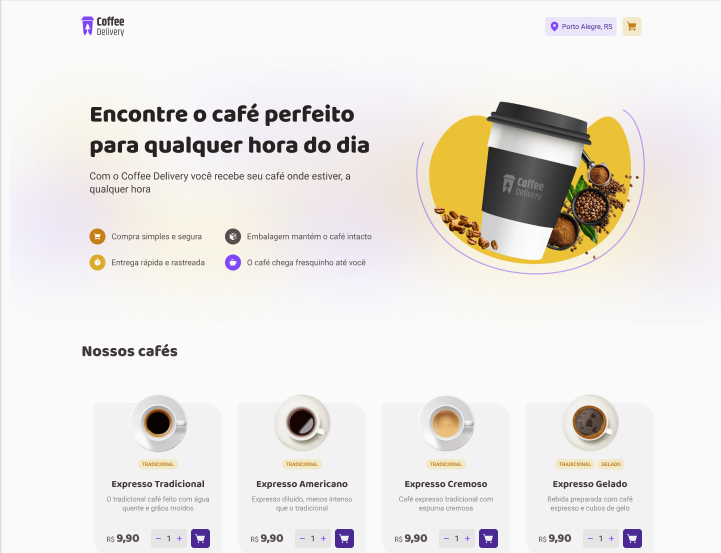
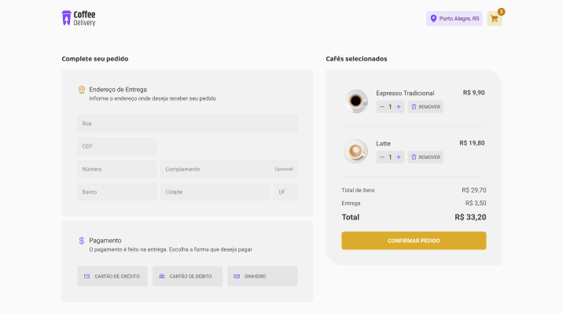

# Descrição do projeto Coffee Delivery

Este é um projeto de design para um serviço de entrega de café chamado "Coffee Delivery". O projeto tem como objetivo fornecer uma interface limpa e simples para os usuários pedirem café e tê-lo entregue em sua porta.

## Recursos

O design inclui os seguintes recursos:

- Uma página inicial com uma imagem de destaque e um botão de chamada para ação para pedir café.
- Uma página de menu onde os usuários podem navegar pelas diferentes opções de café e adicioná-las ao carrinho.
- Uma página de carrinho onde os usuários podem ver os itens de café selecionados, ajustar a quantidade e prosseguir para o checkout.
- Uma página de checkout onde os usuários podem inserir suas informações de entrega e pagamento.

## Design

O design utiliza um esquema de cores marrom e branco para refletir o tema do café. A tipografia é simples e fácil de ler, com uma mistura de fontes serifadas e sem serifas usadas em todas as páginas.

A página inicial apresenta uma imagem de destaque de uma xícara de café e um botão de chamada para ação convidando os usuários a pedir café. A página do menu exibe uma grade de itens de café com seus preços e uma breve descrição. Os usuários podem adicionar itens ao carrinho diretamente desta página.

A página do carrinho mostra um resumo dos itens selecionados, juntamente com a opção de ajustar a quantidade ou remover itens. Os usuários também podem ver o custo total e prosseguir para o checkout a partir desta página.

A página de checkout inclui um formulário para os usuários inserirem suas informações de entrega e pagamento. A página também mostra um resumo do pedido, incluindo os itens selecionados e o custo total.

## Conclusão

Em geral, o projeto de design Coffee Delivery visa fornecer uma interface amigável e direta para pedir café online. O design é simples, porém elegante, com foco na usabilidade e clareza. Foram utilizadas tecnologias como React, HTML, CSS e TypeScript, além de React-Router-Dom para criar as rotas.